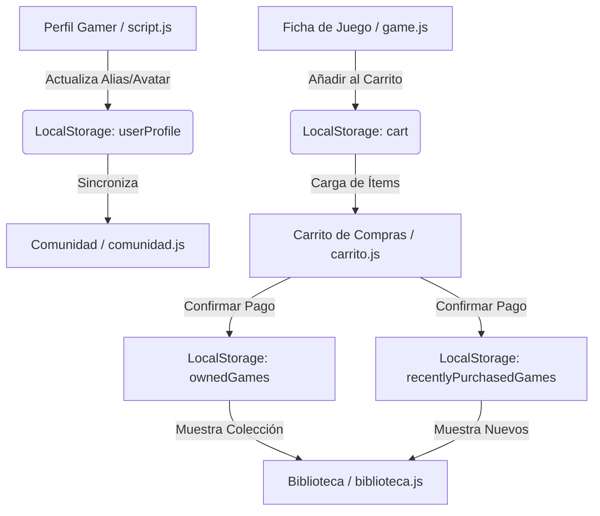

# AFK Store | Plataforma de Videojuegos Premium

Bienvenido a la documentación oficial de **AFK Store**, una plataforma web de tienda de videojuegos, biblioteca digital, feed de comunidad y gestor de perfil gamer de alto impacto visual. El proyecto está construido bajo una arquitectura limpia y responsiva, implementando dinámicas avanzadas en el cliente sin dependencias de frameworks pesados de servidor, lo que la convierte en una SPA-like (Single Page Application) ligera y rápida.

---

## 📋 Tabla de Contenidos
1. [Características Principales](#-características-principales)
2. [Pila Tecnológica](#-pila-tecnológica)
3. [Estructura del Directorio](#-estructura-del-directorio)
4. [Arquitectura y Flujo de Datos](#-arquitectura-y-flujo-de-datos)
5. [Detalle del Sistema de Componentes (POO)](#-detalle-del-sistema-de-componentes-poo)
6. [Descripción de Páginas y Archivos JS](#-descripción-de-páginas-y-archivos-js)
7. [Diseño y Estilos Visuales](#-diseño-y-estilos-visuales)
8. [Uso Local e Inicialización](#-uso-local-e-inicialización)

---

## 🌟 Características Principales

*   **Tienda Dinámica**: Catálogo interactivo de videojuegos con filtros visuales por categorías y carrusel de destacados con controles de pausa automática por hover.
*   **Páginas de Producto Dinámicas**: Enrutamiento virtual en el cliente utilizando parámetros de URL (`?game=id`) que renderizan automáticamente la información técnica, videos (tráilers iframe), precios descontados y reseñas de cualquier juego de la base de datos centralizada.
*   **Carrito de Compras y Pasarela Segura**: Flujo de pago de tres etapas que valida datos de la tarjeta bancaria en tiempo real (formateo inteligente de números de tarjeta `4532 XXXX...` y expiración `MM/AA`) con animaciones de éxito CSS.
*   **Biblioteca del Usuario**: Sistema persistente que separa los juegos por defecto, los comprados en la sesión ("Recién Adquiridos") y la colección total ("Todos tus Juegos").
*   **Comunidad Interactiva**: Muro social donde los usuarios pueden seleccionar un juego de su biblioteca, otorgar puntaje de estrellas, escribir reseñas públicas, dar "me gusta" y responder comentarios en tiempo real.
*   **Perfil Gamer Personalizable**: Sistema de personalización estilo Steam que incluye cambio de alias, mensajes de estado, avatar con glow interactivo según el estado de conexión ("En línea", "Jugando", "Ausente"), cambio de banners de fondo basados en juegos, administración de seguridad y enlaces sociales.

---

## 🛠️ Pila Tecnológica

*   **Estructura**: [HTML5 Semántico](https://developer.mozilla.org/es/docs/Web/HTML) para asegurar una jerarquía limpia, accesibilidad y optimización SEO.
*   **Estilos**: [Vanilla CSS3](https://developer.mozilla.org/es/docs/Web/CSS) con variables globales (CSS custom properties), Flexbox, Grid Layouts, efectos Glassmorphism, animaciones personalizadas (como el Checkmark animado) y diseño 100% responsivo (Mobile-First).
*   **Lógica**: [Vanilla JavaScript (ES6+)](https://developer.mozilla.org/es/docs/Web/JavaScript) estructurado bajo Programación Orientada a Objetos (POO).
*   **Iconografía**: [FontAwesome 6.0.0](https://fontawesome.com/) para todos los iconos interactivos y de plataformas de juego.
*   **Persistencia**: [Web Storage API (LocalStorage)](https://developer.mozilla.org/es/docs/Web/API/Window/localStorage) para mantener la sesión del perfil, biblioteca del usuario, carrito de compras y posts de la comunidad sin necesidad de una base de datos externa.

---

## 📂 Estructura del Directorio

A continuación, se detalla la estructura física del espacio de trabajo:

```text
afkstore/
├── index.html                  # Página de inicio de la tienda virtual
├── README.md                   # Esta guía de documentación
├── css/
│   └── estilos.css             # Estilo CSS central (Glassmorphism, Grid, responsive)
├── html/
│   ├── biblioteca.html         # Vista de la biblioteca gamer del usuario
│   ├── carrito.html            # Vista del carrito de compras y pasarela de pago
│   ├── comunidad.html          # Feed de publicaciones, reseñas y discusiones sociales
│   ├── juegopag.html           # Plantilla receptora para la carga dinámica de videojuegos
│   └── perfil.html             # Panel de administración del perfil estilo Steam
├── js/
│   ├── game.js                 # Base de datos centralizada de juegos y gestor del renderizado de ficha técnica
│   ├── slider.js               # Lógica y renderizado del carrusel interactivo de la tienda
│   ├── catalog.js              # Controlador del catálogo de juegos de la tienda por categorías
│   ├── biblioteca.js           # Gestor de los títulos del usuario (adquiridos y por defecto)
│   ├── carrito.js              # Lógica de compra, formateo de campos e inyección del checkout
│   ├── comunidad.js            # Controlador del muro social, sistema de likes y creación de posts
│   └── script.js               # Control del menú móvil, edición del perfil y sincronización en vivo
└── imgs/                       # Recursos visuales y carátulas de los videojuegos
```

---

## 🔄 Arquitectura y Flujo de Datos

El proyecto implementa un modelo de datos basado en **Web Storage** que intercomunica las diferentes páginas. De este modo, los cambios en una sección afectan el estado de las otras en tiempo real:



### Llaves de LocalStorage Utilizadas:
1.  `userProfile`: Objeto JSON con el nombre, alias, correo, URL del avatar, estado de conexión ("online", "playing", "away"), mensaje de estado, banner de fondo ("default", "gow", "bg3", "re9"), contraseña y enlaces sociales.
2.  `cart`: Array de IDs de juegos que se encuentran en el carrito de compras actualmente.
3.  `ownedGames`: Array de IDs de juegos que el usuario ya posee en su biblioteca.
4.  `recentlyPurchasedGames`: Array de IDs de juegos comprados durante la sesión actual (se limpia o actualiza al procesar un nuevo checkout).
5.  `communityPosts`: Array de objetos que contienen la información de las publicaciones en el muro, likes y arreglos de comentarios.

---

## 🏛️ Detalle del Sistema de Componentes (POO)

El código JavaScript de AFK Store utiliza herencia y clases abstractas para modularizar el diseño de la interfaz:

### 1. Clase Abstracta `GamePage` ([game.js](file:///Users/jairbelkerlinorodriguez/Desktop/afkstore/js/game.js))
Funciona como el molde estructural para cualquier página de detalles de videojuego. Evita instanciarse directamente y provee métodos comunes:
*   `getRatingStarsHTML(stars)`: Construye las estrellas rellenas/vacías según la calificación.
*   `getPriceHTML()`: Retorna el formato HTML del precio considerando ofertas (descuentos porcentuales) o etiquetas de juegos "Gratis".
*   `render()`: Inyecta el template del tráiler, descripción, requisitos técnicos y opiniones en el contenedor `#game-content-container`.

Cada videojuego en la base de datos se declara como una clase hija extendida (por ejemplo, `class GodOfWar extends GamePage`, `class BaldursGate3 extends GamePage`).

### 2. Clase Abstracta `BaseGameCard` ([catalog.js](file:///Users/jairbelkerlinorodriguez/Desktop/afkstore/js/catalog.js))
Define la interfaz física y lógica para las tarjetas del catálogo de la tienda:
*   Genera de forma limpia y dinámica el HTML de cada tarjeta.
*   Controla el enrutamiento al hacer clic redirigiendo a `html/juegopag.html?game=id`.

Las subclases como `GodOfWarCard`, `BaldursGate3Card`, etc., heredan sus propiedades inyectando los datos correspondientes en el constructor principal mediante `super()`.

### 3. Clase `GameSlider` ([slider.js](file:///Users/jairbelkerlinorodriguez/Desktop/afkstore/js/slider.js))
Gestiona el carrusel destacado superior de la tienda.
*   Se alimenta dinámicamente de un subconjunto de instancias de juegos en `game.js`.
*   Implementa navegación por puntos, flechas direccionales e inicio/parada automática sincronizada con los eventos `mouseenter` y `mouseleave` del cursor del usuario.

---

## 📄 Descripción de Páginas y Archivos JS

### 🛒 Tienda Principal
*   **Página**: [index.html](file:///Users/jairbelkerlinorodriguez/Desktop/afkstore/index.html)
*   **Javascript**:
    *   [slider.js](file:///Users/jairbelkerlinorodriguez/Desktop/afkstore/js/slider.js): Inyecta el carrusel de juegos en `#featured-slider-container`.
    *   [catalog.js](file:///Users/jairbelkerlinorodriguez/Desktop/afkstore/js/catalog.js): Agrupa los juegos por categorías y renderiza las tarjetas en `#catalog-categories-container`.

### 🎮 Detalle del Juego (Dynamic Router)
*   **Página**: [juegopag.html](file:///Users/jairbelkerlinorodriguez/Desktop/afkstore/html/juegopag.html)
*   **Javascript**: [game.js](file:///Users/jairbelkerlinorodriguez/Desktop/afkstore/js/game.js).
*   **Funcionamiento**: Al abrir la página, el script lee el parámetro `game` en la URL (ej. `?game=resident-evil-9`). Busca el ID en el mapa de enrutamiento interno (`gamesMap`) e instancia la clase correspondiente para renderizar la página. Si no existe un parámetro válido, muestra por defecto *God of War*.

### 📚 Biblioteca Digital
*   **Página**: [biblioteca.html](file:///Users/jairbelkerlinorodriguez/Desktop/afkstore/html/biblioteca.html)
*   **Javascript**: [biblioteca.js](file:///Users/jairbelkerlinorodriguez/Desktop/afkstore/js/biblioteca.js).
*   **Funcionamiento**: Lee `localStorage` para recuperar la lista de juegos del usuario. Si es la primera ejecución, inicializa una lista base por defecto. Permite renderizar y filtrar en tiempo real los adquiridos recientemente de aquellos que forman parte de la colección histórica.

### 💳 Carrito y Checkout de 3 Pasos
*   **Página**: [carrito.html](file:///Users/jairbelkerlinorodriguez/Desktop/afkstore/html/carrito.html)
*   **Javascript**: [carrito.js](file:///Users/jairbelkerlinorodriguez/Desktop/afkstore/js/carrito.js).
*   **Funcionamiento**:
    *   **Paso 1 (Resumen)**: Lista los juegos agregados, calcula el precio total estimado acumulado y ofrece la opción de eliminar ítems.
    *   **Paso 2 (Formulario de Pago)**: Captura la información de pago. Tiene validación en tiempo real de campos requeridos (nombre, número de tarjeta, CVV y vencimiento) y bloqueo dinámico del botón "Pagar". Auto-formatea los números de tarjeta con espacios de a 4 dígitos e introduce la barra inclinada `/` en la fecha de vencimiento.
    *   **Paso 3 (Éxito)**: Limpia el carrito, transfiere los IDs a la lista de biblioteca (`ownedGames` y `recentlyPurchasedGames`) y muestra un checkmark de aprobación animado en CSS.

### 💬 Comunidad y Reseñas
*   **Página**: [comunidad.html](file:///Users/jairbelkerlinorodriguez/Desktop/afkstore/html/comunidad.html)
*   **Javascript**: [comunidad.js](file:///Users/jairbelkerlinorodriguez/Desktop/afkstore/js/comunidad.js).
*   **Funcionamiento**:
    *   Carga un feed inicial con opiniones preestablecidas muy pintorescas que se pueden almacenar en LocalStorage.
    *   Los usuarios pueden publicar nuevas reseñas seleccionando un juego del catálogo desplegable, asignando calificación de 1 a 5 estrellas mediante un selector visual interactivo, y redactando el texto.
    *   Admite interacción social (dar "me gusta" incrementando el contador y agregar comentarios debajo de cualquier publicación).
    *   Incluye un sidebar de tendencias y reglas de conducta de la plataforma.

### 👤 Perfil Gamer y Utilidades Centrales
*   **Página**: [perfil.html](file:///Users/jairbelkerlinorodriguez/Desktop/afkstore/html/perfil.html)
*   **Javascript**: [script.js](file:///Users/jairbelkerlinorodriguez/Desktop/afkstore/js/script.js).
*   **Funcionamiento**:
    *   Controla el menú hamburguesa móvil responsivo.
    *   Carga y guarda de manera interactiva el perfil del usuario.
    *   **Sincronización en vivo (Live Preview)**: Al editar campos como Alias, Mensaje de estado, Estado de conexión o Banners de fondo, estos se reflejan de inmediato en la cabecera visual de la página.
    *   Implementa pestañas intercambiables en CSS/JS (General, Seguridad, Redes).
    *   Permite cargar una foto de perfil del disco local mediante `FileReader` convirtiéndola a base64 para guardarla en `localStorage`.
    *   Maneja un modal seguro para cambio de contraseñas con validación en tiempo real (mismos caracteres).

---

## 🎨 Diseño y Estilos Visuales

Todo el apartado estético está concentrado en [estilos.css](file:///Users/jairbelkerlinorodriguez/Desktop/afkstore/css/estilos.css) y destaca por:

*   **Paleta de Colores Gamer Oscura**: Fondos oscuros profundos (`#0f172a`, `#1e293b`) combinados con acentos vibrantes (naranja gamer `#ff5722`, azul eléctrico `#3b82f6`, verde lima para éxitos `#10b981`).
*   **Efecto Glassmorphism**: Uso extendido de `backdrop-filter: blur(12px)` con bordes semitransparentes para tarjetas y menús flotantes, dando un aspecto futurista y premium.
*   **Estados de Conexión Glow**: El marco del avatar cambia de color y adquiere una sombra difusa intermitente (*glow effect*) según el estado:
    *   *En línea*: Verde brillante.
    *   *Jugando*: Azul cian.
    *   *Ausente*: Naranja ámbar.
*   **Banners de Perfil**: Al cambiar el banner en la edición, se le aplica una clase dinámica al contenedor de cabecera (`banner-gow`, `banner-bg3`, `banner-re9`) cargando una imagen panorámica de fondo difuminada mediante un degradado negro lineal.

---

## 🚀 Uso Local e Inicialización

Al ser una aplicación web estática pura (sin bases de datos en la nube ni APIs externas complejas):
1.  Descarga o clona la carpeta del proyecto en tu computadora.
2.  Abre el archivo [index.html](file:///Users/jairbelkerlinorodriguez/Desktop/afkstore/index.html) directamente en cualquier navegador moderno (Google Chrome, Mozilla Firefox, Microsoft Edge, Safari) o utiliza la extensión *Live Server* en tu editor de código.
3.  Los scripts se encargarán automáticamente de inicializar los datos por defecto en tu `LocalStorage` al cargar las secciones por primera vez.
